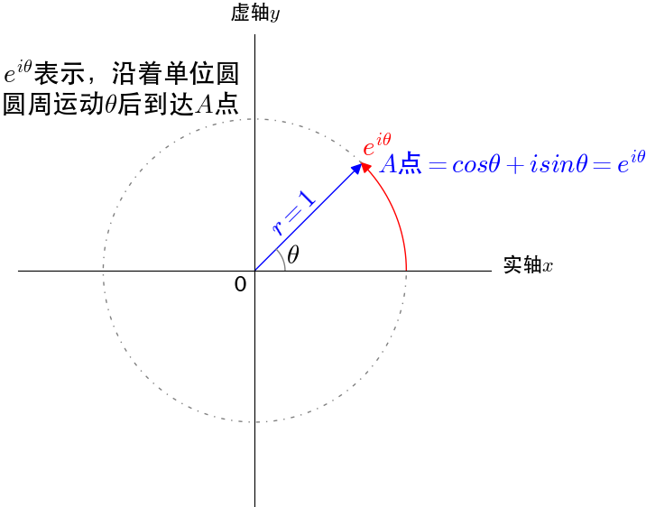

# 傅里叶变换

> 参考文章：
>
> 1. [3Blue1Brown - But what is the Fourier Transform? A visual introduction.](https://www.3blue1brown.com/lessons/fourier-transforms)
> 2. [But what is the Fourier Transform? A visual introduction. - YouTube](https://www.youtube.com/watch?v=spUNpyF58BY)
> 3. [傅里叶分析之掐死教程（完整版）- 知乎 (zhihu.com)](https://zhuanlan.zhihu.com/p/19763358)
> 4. [如何通俗地解释欧拉公式（e^πi+1=0）？](https://www.matongxue.com/madocs/8/)

## 何为欧拉公式

欧拉公式：$e^{iθ}=\cos θ+i\sin θ$ 

$e^{iθ}$ 通过单位圆的圆周运动来描述单位圆上的点，$\cosθ+i\sinθ$ 通过复平面的坐标来描述单位圆上的点。因此，$e^{iθ}=\cos θ+i\sin θ$ 是同一个点的两种等价的描述方式。

$e^{i2\pi}$：表示沿单位圆运动一周

$re^{i2\pi}$：表示沿半径为 r 的圆运动一周

$e^{i2\pi t}$：若时间 $t$ 的单位是 s，则该式表示 1s 内绕单位圆运动一周

$e^{i2\pi ft}$（缠绕函数）：$f$ 表示缠绕频率，用来控制运动速率。若 $f$ 较小，比如 0.5，则 1s 内只能绕单位圆运动半周；若 $f$ 较大，比如 2，则 1s 内可以绕单位圆运动两周。

## 傅里叶变换的解释

假设 $g(t)$ 为音频的时域函数（时间-空气压力），如下面动图中的上图所示。将其与缠绕函数 $e^{-i2\pi ft}$（加负号是因为我们希望图像是按照顺时针方向进行缠绕）相乘，则可以得到一个新的函数 $g'(t)=g(t)e^{-i2\pi ft}$，其图像如下面视频中的下图所示，该函数的含义为按照频率 $f$ 将 $g(t)$ 沿着单位圆进行缠绕。可以这么理解，g(t) 是将音频的时域函数按照水平线的方向进行排列，而 g'(t) 是将音频的时域函数按照单位圆的方向进行排列。

在这里，缠绕频率 $f$ 可以理解为把 1s 的音频信号在单位圆上缠绕 $f$ 圈。比如 $f=0.5$ 表示 1s 的音频信号可以缠绕单位圆半圈；$f=1$ 表示 1s 的音频信号可以缠绕单位圆一圈；以此类推 ...... 不同频率 $f$ 的缠绕过程如下图所示。

现在看一个特殊情况（如下图所示），假设此时缠绕频率 $f=3$，这表示 1s 的音频信号可以缠绕单位圆 3 圈，若此时音频信号的频率也是 3，则 1 个周期的音频信号就能够缠绕单位圆 1 圈。也就是说，当缠绕频率和音频信号的频率相等，1 个周期的音频信号刚好能缠绕单位圆 1 圈。

这是一个特殊的状态，将其与其它缠绕频率下的缠绕图像比较（如下图所示），可以发现，其它状态下的图像都是原点对称的（图像的质心在原点），而这个特殊的状态下的图像不是原点对称的，而是向某个方向突出（图像的质心也往这个方向偏移）。因此，我们可以利用这个特性来判断缠绕频率和音频信号的频率是否相等，以此来求解出音频信号的频率的具体数值。最简单的方法就是枚举出缠绕频率的所有可能的取值，找出其中可以令质点偏移的那个频率，而这个频率必然就是音频信号的频率。

事实证明，若音频信号由多种频率组合而成，则当且仅当缠绕频率等于这些频率时才能让质心发生偏移（如下图所示。其中，右边是 "缠绕频率-质心偏移" 图）。因此，通过这个方法，我们就可以从音频信号中分离出组成音频的所有频率分量，而这个方法也就是傅里叶变换。

在此处，质心可以定义为缠绕图上所有点的期望值。根据这个定义，我们可以在缠绕图上均匀选取足够多的点来近似求出质心，即$\frac{1}{N} \sum_{k=1}^{N} g\left(t_{k}\right) e^{-2 \pi i f t_{k}}$（如下图所示）。

但更精确地来说，我们应该用积分来求解质点，也就是 $\frac{1}{t_{2}-t_{1}} \int_{t_{1}}^{t_{2}} g(t) e^{-2 \pi i f t} d t$。由于质心仅在缠绕频率等于音频信号的频率分量时才发生偏移，而在其它情况下处于原点位置，所以质心的取值只有靠近 0 （当缠绕频率不等于音频信号的频率分量时）和远大于 0 两种（当缠绕频率等于音频信号的频率分量时），并且把 $\frac{1}{t_{2}-t_{1}}$ 去掉完全不影响最后的结果（如下视频所示）。此时，我们就得到了质心的最终表达式  $\hat{g}(f)=\int_{∞}^{-∞} g(t) e^{-2 \pi i f t} d t$（取 ∞ 是为了囊括音频信号上的所有点），这个公式也被称为傅里叶变换公式。通过这个公式并利用前述的方法，我们就可以从音频信号中分离出所有的频率分量。

## 傅里叶变换的应用

### 去除高频信号

