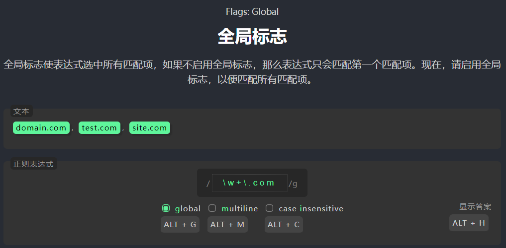
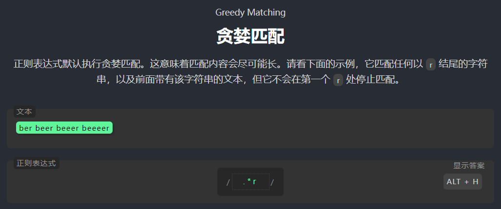

# 正则有多难

## 备忘单

## 分组

## 断言

## 标志

## 贪婪和懒惰

## 非/单词边界

/a\\b/：表示匹配字符 a，并且在该字符后面必须是单词边界；

/a\\B/：表示匹配字符 a，并且在该字符后面必须是非单词边界；

/\\ba/：表示匹配字符 a，并且在该字符前面必须是单词边界；

/\\Ba/：表示匹配字符 a，并且在该字符前面必须是非单词边界。

